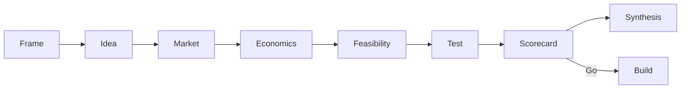

# Idea Discovery Playbook

Validate a **software idea before you build** — interviews, market research, economics, pretotype tests, go/no-go scorecards. [Agent Skills](https://agentskills.io/) · [skills.sh](https://skills.sh/b/eltntawy/idea-discovery-playbook)

## Install

```bash
npx skills add eltntawy/idea-discovery-playbook -g -y
```

## Start

**Entry:** `discovery-playbook` (phases 0–7) — in chat use **`/discovery-playbook`** or:

```text
Use discovery-playbook to validate this idea end to end:
A board for solo founders to track validation experiments.
Topic slug: solo-validation-board
```

**Build only after** `idea-scorecard` → **Strong go** (60–75) or **Conditional go** (45–59). Stops early on kill gates.

**Weekend path:** `/discovery-playbook-short` — or `assumption-map` → `problem-discovery` → `validation-experiments` → `idea-scorecard`.

| Slash command | Skill |
| --- | --- |
| `/discovery-playbook` | Full flow |
| `/discovery-playbook-short` | Weekend path |
| `/assumption-map` | Assumptions |
| `/problem-discovery` | Interviews |
| `/discover-market` | Market + competitors |
| `/validation-experiments` | Demand test |
| `/idea-scorecard` | Go / no-go |
| `/discovery-synthesis` | Summary report |

`npx skills add` installs **skills** only. Slash commands live in `.cursor/commands/` (this repo) — [commands/README.md](commands/README.md) to copy globally.

## Flow



0 Frame · 1 Idea · 2 Market · 3 Economics · 4 Feasibility · 5 Priced demand test · 6 Scorecard · 7 Synthesis · then `pmf-sean-ellis` after ship.

**Rules:** payment &gt; behavior &gt; signups &gt; compliments. Kill if LTV:CAC &lt; 2:1 (see `revenue-model`).

## Skills (16)

`discovery-playbook` · `assumption-map` · `problem-discovery` · `jtbd-interviews` · `behavior-led-validation` · `market-research` · `market-sizing` · `competitor-landscape` · `positioning-wedge` · `revenue-model` · `feasibility-gate` · `validation-experiments` · `idea-scorecard` · `discovery-synthesis` · `regulatory-risk-scan` · `pmf-sean-ellis`

```bash
npx skills add eltntawy/idea-discovery-playbook --list
```

Details: `skills/discovery-playbook/SKILL.md`. Optional artifacts: `discovery/<slug>/` (briefs, research, experiments, scorecards).

## Contributing

MIT — [LICENSE](LICENSE). Keep `SKILL.md` files under ~500 lines.
