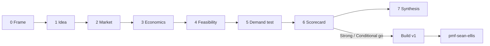

# Ideation Discovery Skills

Agent skills for **software idea validation** before you build — interviews, market research, economics, pretotype tests, and go/no-go scorecards. [Agent Skills](https://agentskills.io/) format · [Skills CLI](https://github.com/vercel-labs/skills).

[](https://skills.sh/eltntawy/ideation-discovery-skills)

## Install

```bash
npx skills add eltntawy/ideation-discovery-skills -g -y
npx skills add eltntawy/ideation-discovery-skills --list   # list skills
```

## Chat commands (Cursor, Claude Code, Copilot)

Type `/` in chat — no need to memorize skill names.

| Command | Skill |
| --- | --- |
| `/discovery-playbook` | Full flow (entry point) |
| `/discovery-playbook-short` | Weekend path |
| `/assumption-map` | Assumption map |
| `/problem-discovery` | Problem interviews |
| `/discover-market` | Market + competitors |
| `/validation-experiments` | Demand test design |
| `/idea-scorecard` | Go / no-go scorecard |
| `/discovery-synthesis` | One summary report |

Example:

```text
/discovery-playbook A board for solo founders to track validation experiments. Topic slug: solo-validation-board
```

Commands ship in `.cursor/commands/` and `.claude/commands/`. Copilot: `.github/prompts/*.prompt.md` (enable `chat.promptFiles` in VS Code). See [commands/README.md](commands/README.md) for copy-to-global steps.

## Entry point

**`discovery-playbook`** — start here for the full flow. Invoke it **by name** (skills use `disable-model-invocation: true`):

```text
Use discovery-playbook to validate this idea end to end:

A board that helps solo founders track validation experiments instead of scattered Notion pages.

Topic slug: solo-validation-board
```

Or: `/discovery-playbook`

The agent runs phases 0–7, saves artifacts under `discovery/<slug>/` (optional), and stops early if a kill gate fails. **Build only after** `idea-scorecard` → **Strong go** (60–75) or **Conditional go** (45–59).

## Flow (phases 0–7)



| Phase | Skills | Exit |
| --- | --- | --- |
| 0 Frame | `assumption-map`, `regulatory-risk-scan` if needed | Top assumptions + tests |
| 1 Idea | `problem-discovery`, optional `jtbd-interviews` | Problem validated (~half+ interviews) |
| 2 Market | `market-research`, `competitor-landscape` | Wedge + competitors |
| 3 Economics | `market-sizing`, `revenue-model`, `positioning-wedge` | Size, LTV:CAC, positioning |
| 4 Feasibility | `feasibility-gate` | Not **Reject** |
| 5 Demand test | `validation-experiments` | Priced test; fail threshold not hit |
| 6 Decision | `idea-scorecard` | **Strong** or **Conditional go** |
| 7 Synthesis | `discovery-synthesis` | One researcher pack |
| After ship | `pmf-sean-ellis` | ≥40% “very disappointed” (target segment) |

**Evidence:** payment &gt; behavior &gt; signups &gt; compliments &gt; views. **Economics:** kill if LTV:CAC &lt; 2:1; strong go needs ≥ 3:1 (see `revenue-model`).

### Short path (weekend)

`assumption-map` → `problem-discovery` (8–10 interviews) → `validation-experiments` (priced landing) → `idea-scorecard`

### Example prompts (same topic slug)

```text
Use assumption-map for solo-validation-board
Use problem-discovery for solo-validation-board — ICP solo founders pre-PMF
Use market-research for solo-validation-board
Use idea-scorecard for solo-validation-board — read discovery/solo-validation-board/ first
Use discovery-synthesis for solo-validation-board
```

## All skills (16)

| Skill | Use when |
| --- | --- |
| `discovery-playbook` | **Entry** — full flow, routing, artifacts |
| `assumption-map` | Riskiest assumptions, test queue |
| `problem-discovery` | Mom Test interviews, ICP, pain |
| `jtbd-interviews` | Why buyers switch / JTBD |
| `behavior-led-validation` | One end-to-end orchestration memo |
| `market-research` | Live market + gap memo |
| `market-sizing` | TAM / SAM / SOM |
| `competitor-landscape` | Competitor matrix, battle cards |
| `positioning-wedge` | Category, wedge, messaging |
| `revenue-model` | Pricing, LTV:CAC |
| `feasibility-gate` | Build / wait / reject |
| `validation-experiments` | Fake door, smoke test, ILI |
| `idea-scorecard` | Go / conditional / pivot / kill |
| `discovery-synthesis` | Single summary report |
| `regulatory-risk-scan` | Regulated domains |
| `pmf-sean-ellis` | PMF after prototype |

## Workspace (optional)

```
discovery/INDEX.md
discovery/<slug>/TOPIC.md
discovery/<slug>/{briefs,research,experiments,scorecards}/
```

Key files: `briefs/*-brief.md`, `research/*-{market,competitors,revenue,assumptions,feasibility}.md`, `experiments/*-experiment.md`, `scorecards/*-scorecard.md`, `*-synthesis.md`. Memos use **Facts, Assumptions, Evidence, Analysis, Decision, Next experiment**. Details in `skills/discovery-playbook/SKILL.md`.

## Related (external)

```bash
npx skills add ferdinandobons/startup-skill -g -y      # strategy, pitch
npx skills add brandonsgitstub/jtbd-skill -g -y        # JTBD docx workflow
```

## Contributing

Keep each `SKILL.md` under ~500 lines; skill-relative links only. MIT — [LICENSE](LICENSE).
